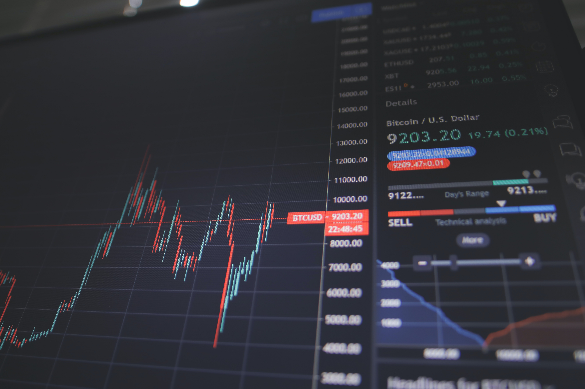

I have a tendency to revert back to my investing roots when the markets and economic situation turn “***interesting***”. We are definitely in an interesting period right now. 

Today I wanted to touch on the ***psychological impact*** these times of turmoil have on investors. I have a unique perspective of being both on the investing side and the capital raising side for my startup.  In both cases, markets and investors have retrenched, reducing the dollar amount and frequency of investments they are deploying. 

This is the exact opposite of what should be happening. Investors, those who are good, will be deploying capital at an increased rate over these periods of economic turmoil. As asset prices decrease across real estate, stocks, crypto, and businesses, the risk-to-reward probabilities start to skew towards an asymmetric nature. This means that the probability of losing their investment or having a large decline in it, versus the probability of outsized returns that are multiples higher than the potential loss, ***become weighted in the favor of the outsized returns***. This is because the amount of equity a single dollar will buy, grows as the asset price declines. When you couple the asymmetrical perspective with strong foundational businesses you get the type of situation where 5-10x plus returns are probable. 

The problem is that humans allow group thinking and emotion into the equation of whether or not they should invest. That is the reason you see a large-scale pullback, like now, from investors across entire sectors. Conversely, when times are good and growth is happening, you see all asset classes being invested at ever-increasing prices. In these environments, the asymmetrical nature of great investments is reduced or gone completely, because the prices at which investments are being made are way too high to justify the potential returns. There is a higher risk than potential returns. Yet because of the group thinking and emotional nature of investors, they leap in without thought of potential losses. We can see this within the portfolios of many investors who have losses of 60% plus that they were investing without regard to the non-asymmetrical nature of the investment. 

Much like the famous Warren Buffett quote ***“Be greedy when others are fearful and fearful when others are greedy”*** we are approaching the point where it’s time to be greedy, not fearful. Get rid of your emotions and start investing logically where the probabilities are in your favor… 

Ad Astra