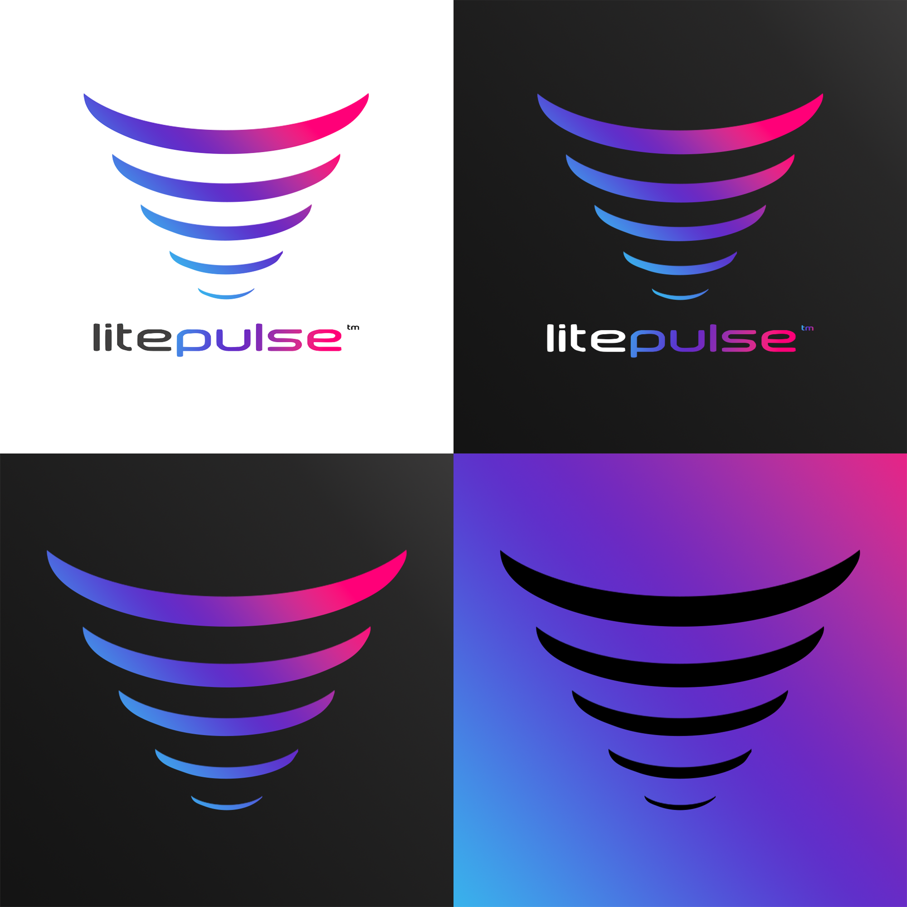
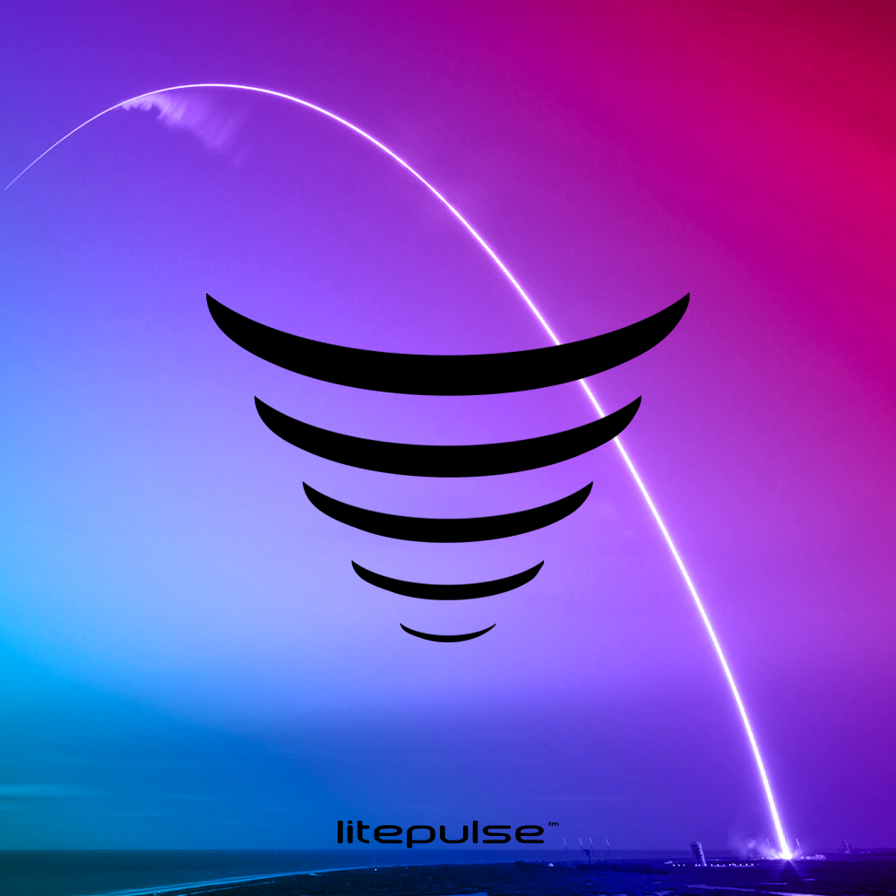
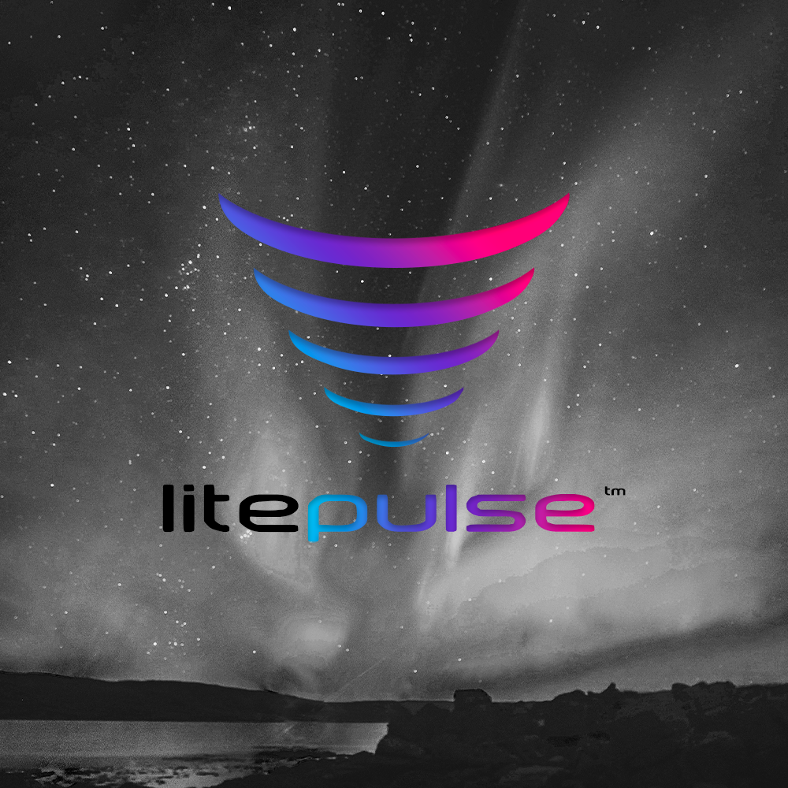
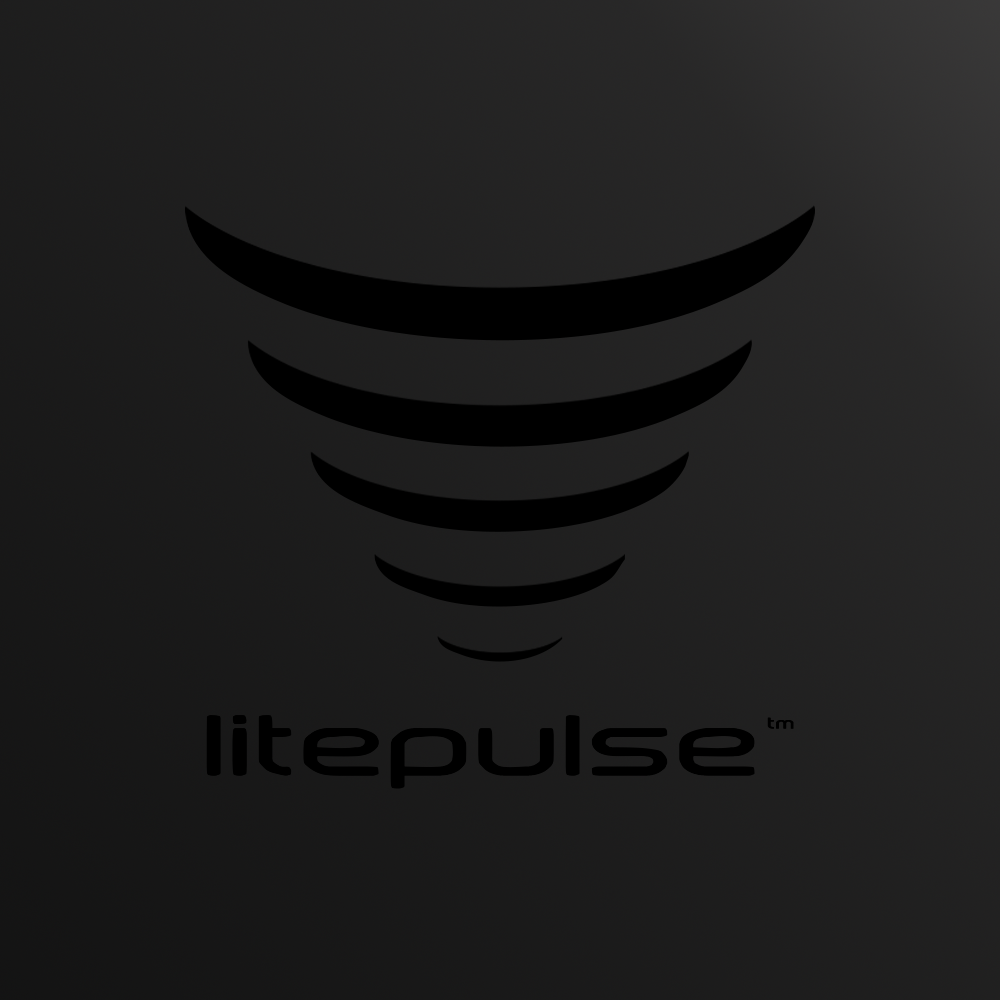
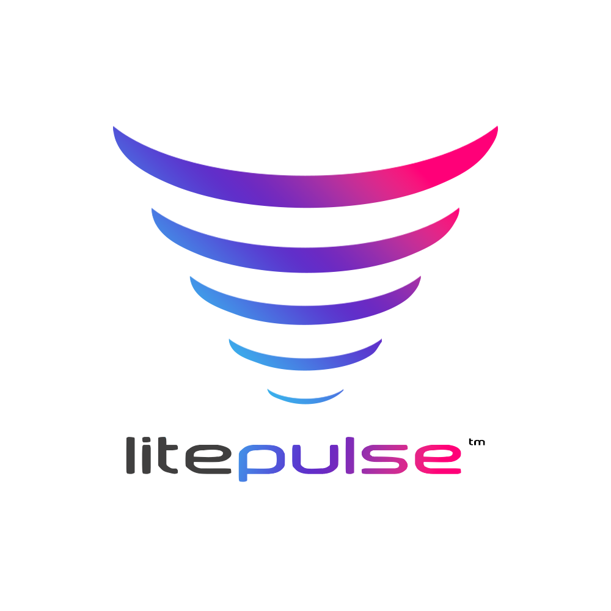
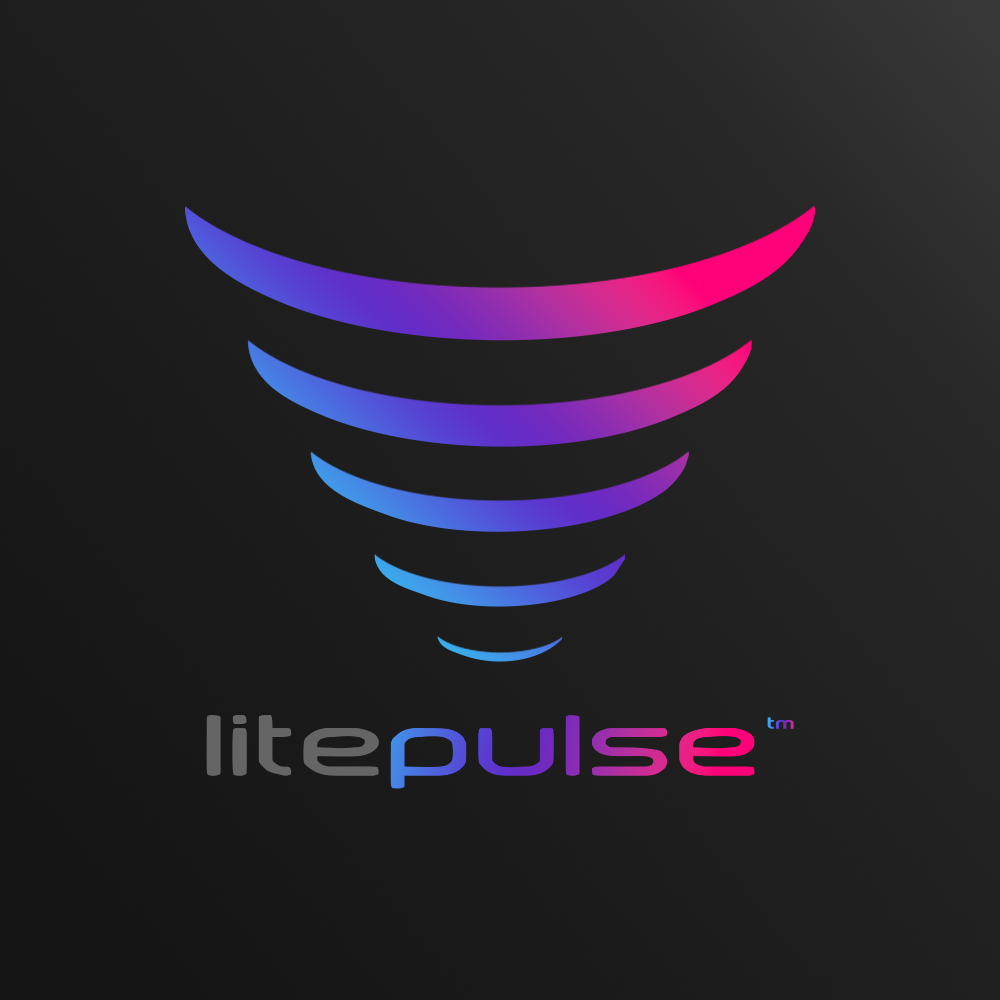
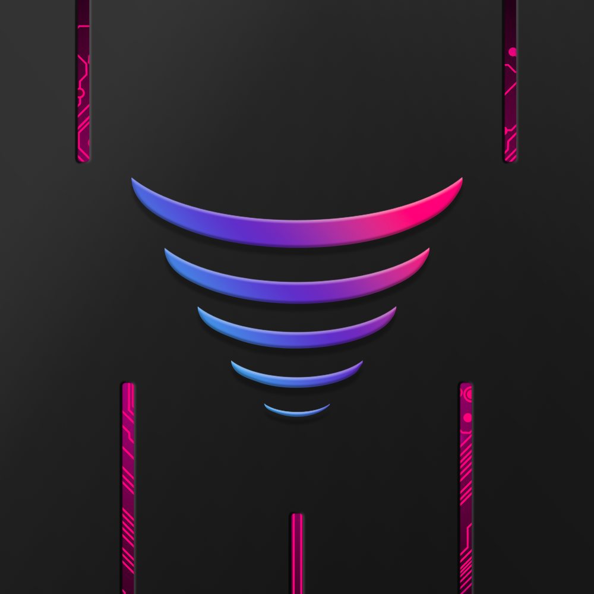

I wanted to take a quick second to introduce ***Litepulse’s new branding*** to the world. The team did an amazing job! The new logo, colors, and icon capture the essence of Litepulse perfectly. 

The gradient of colors signifies our use of ***multiple frequencies*** in our transmissions. The icon draws its inspiration from the wifi logo and signifies the transmission of ***power across vast distances.*** With the font, we wanted something clean and forward-looking. 

Overall it’s a great step up from our old logo and typeset. 

Let me know what you think over at www.twitter.com/thekarlstedman

Ad Astra