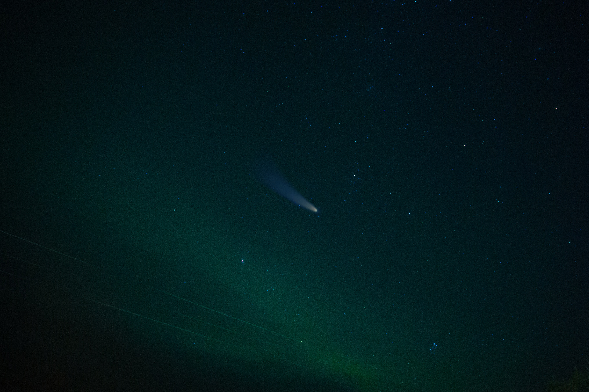

Here are some facts for you. 

The average muzzle velocity of a 9mm bullet is ***820 miles per hour***. 

The average diameter of a 9 mm bullet is, you guessed it, roughly 9 mm (9.01mm). 

***Now would you want to jump in front of a 9 mm bullet after being shot out of a gun?*** Of course not, it does some nasty damage to our bodies when it impacts us. Would you feel comfortable standing behind a wall made out of Titanium or aluminum that’s wrapped in a sheet of Kevlar?  Most people probably would say yes. ***But what if we speed that bullet up by a factor of 19 or 20x?*** So it’s traveling at 15,000 miles per hour…

Would you still feel comfortable standing behind that wall? ***Probably not***. 

Now, why am I asking such a gruesome question? Put simply, that’s exactly what we are asking anyone who goes up into space to do right now… But you say, that space is very big and very empty. 

Yes, it is except when it’s not. 

According to [Wayfinder](https://www.privateer.com/) (go check it out. It’s pretty interesting) there are currently ***6852 active satellites, 3509 inactive satellites, 8114 Uncategorized objects, 2089 rocket parts, and 11823 debris, that are currently being tracked***. This list is not exhaustive and it only covers objects roughly larger than the aforementioned 9 millimeters. There are literally millions of other objects that are not being tracked. 

Even though space is rather large, there are only a limited number of orbital paths that are suitable for vehicles. I have seen many projections about the number of satellites and vehicles that are expected to be in orbit by 2030 and let’s just estimate with the current growth that there will be 100,000 in orbit by then. 

With that many satellites expected to be launched, space around Earth starts to be a little bit smaller. 

Now let’s add another element to the equation, collisions, and attacks. A recent Russian demonstration is a prime example. They launched an ASAT (direct-ascent hit-t0-kill) test in which they struck and destroyed one of their satellites in orbit. It resulted in more than 1,500 pieces (trackable) of debris (I will not get into the weaponization of space now, that’s for another post). The biggest issue with the ASAT test is not what we can track but rather what we cannot. Debris smaller than the aforementioned trackable size is actually a massive issue. It’s also one that we are blind to. If you can’t track it, you can’t avoid it. 

So when we increase the number of orbital vehicles by a factor of 9 or 10x, collisions and potential attacks will inevitably happen which will result in a much higher amount of orbital debris. Much of it will not trackable without much better optics, sensors and systems to do so.

So I’ll leave you with some questions - 

***Knowing that the amount of debris is going to grow a large amount, would you really want your only power systems (large solar cell arrays that have a massive footprint) to be the only way to power your satellites, space stations, and other orbital vehicles?***

***Would you want your children to be sent onto a space station without a dramatic increase in shielding? Will that increase in shielding be enough?***

Food for thought. 

There are solutions being created to the large debris problem, however, the bigger issue (small debris) does not have a viable solution as of yet. It’s an issue, both a small one and a very large one at the same time.

***It’s time to start planning for what is coming, not what is.***

Ad Astra
